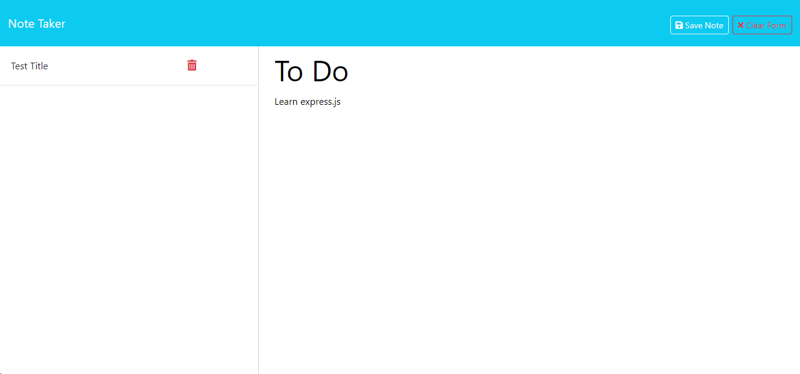
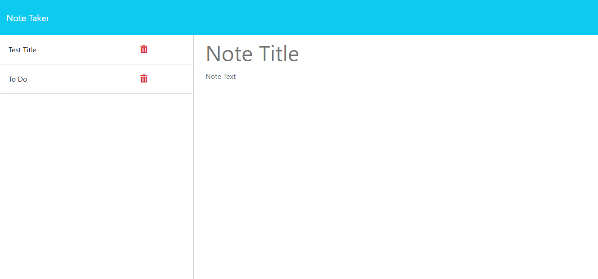

# Express.JS NoteTaker
A simple program using express.js to add notes to a notetaker app! 

  ## Technologies Used

  nodemon 

  express.js

  uuid

  ## Credits

 * Class notes

* [Express.js Tutorial](https://youtu.be/L72fhGm1tfE?si=W__XVMMVY44-5YTP)

* Sandy Smith, Tutor

## License

This project is licensed under the MIT license.